

  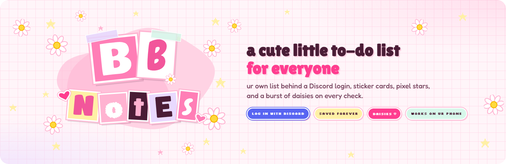

  
  
  
  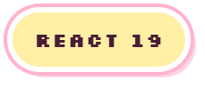
  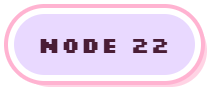
  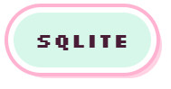

  A tiny notebook with a pink Y2K scrapbook look — cut-out letters, sticker cards, 
  pixel stars, and a burst of daisies every time something gets checked off. 
  Three pages behind a book's spine: <b>to-dos</b>, <b>notes</b> and <b>reminders</b>.

  BB is for <a href="https://khihani.com/b/beck-and-baddie">Beck &amp; Baddie</a> — two VRChat avatars made by my friend <a href="https://dyzzy.store/b/beck-by-dyzzy">Dyzzy</a> and <a href="https://khihani.com/b/baddie-by-khihani">Khihani</a>, whose showcase this whole look is based on. 
  Beck was modelled after his childhood with his Mom: the music she introduced him to, the cartoons they watched, 
  the colours of his childhood bedroom walls, and — most importantly — her favourite thing: flowers. 
  That's why there's a daisy on every check. Much of the proceeds from Beck go to her care. ♡  
    <a href="https://www.youtube.com/watch?v=mwiBkRRgyfs"> You can check the showcase here.</a>
  

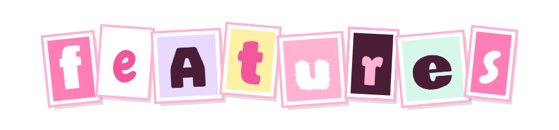

<table align="center">
  <tr>
    <td>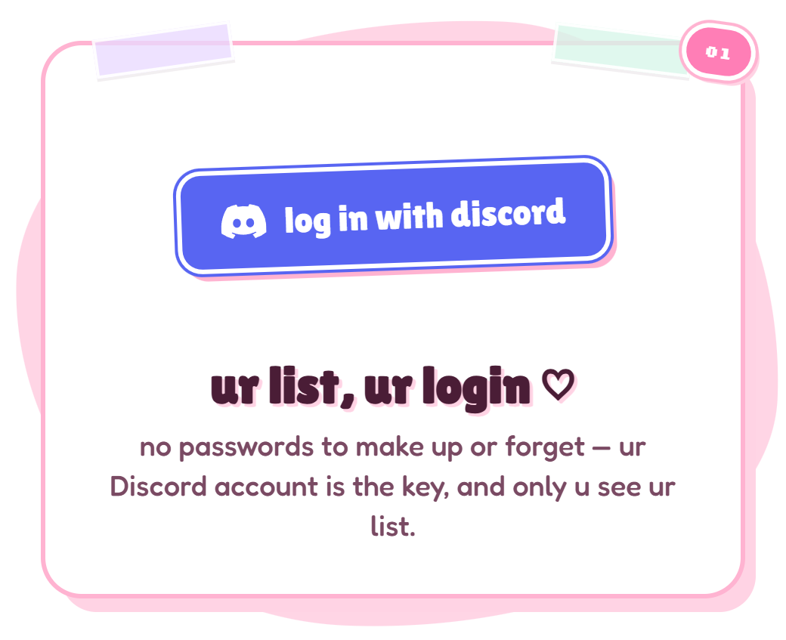</td>
    <td>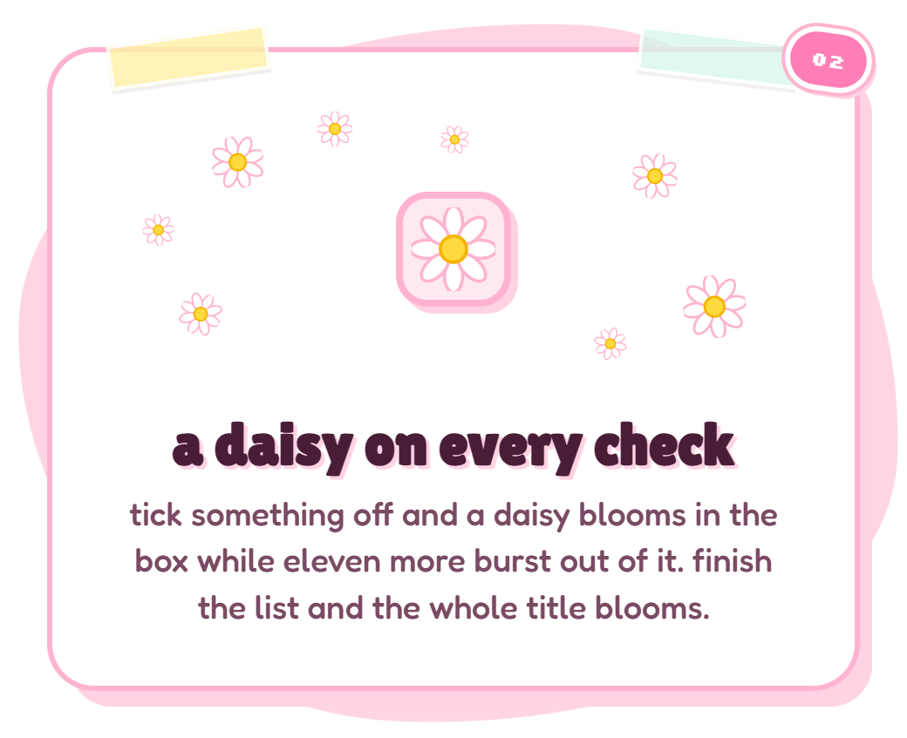</td>
  </tr>
  <tr>
    <td>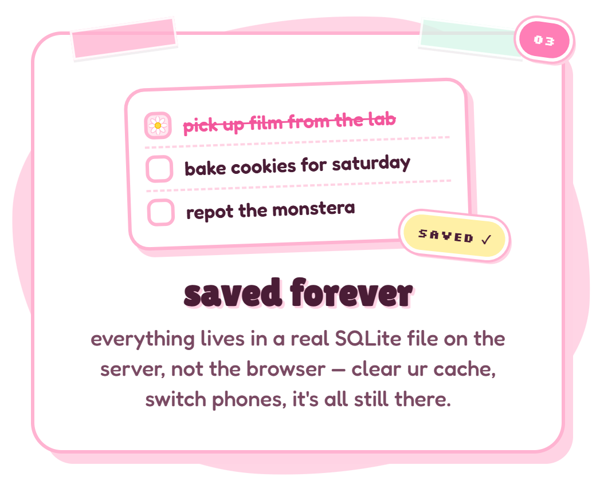</td>
    <td>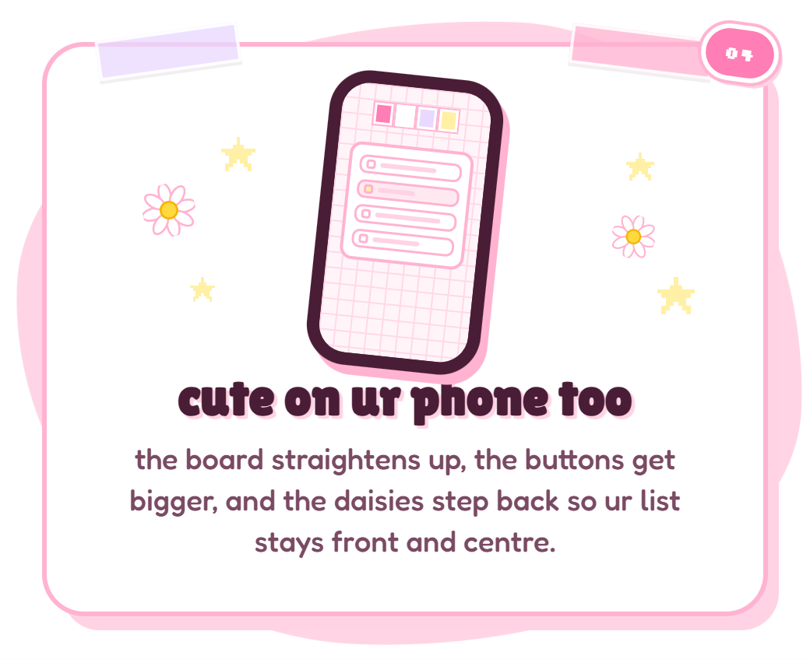</td>
  </tr>
  <tr>
    <td>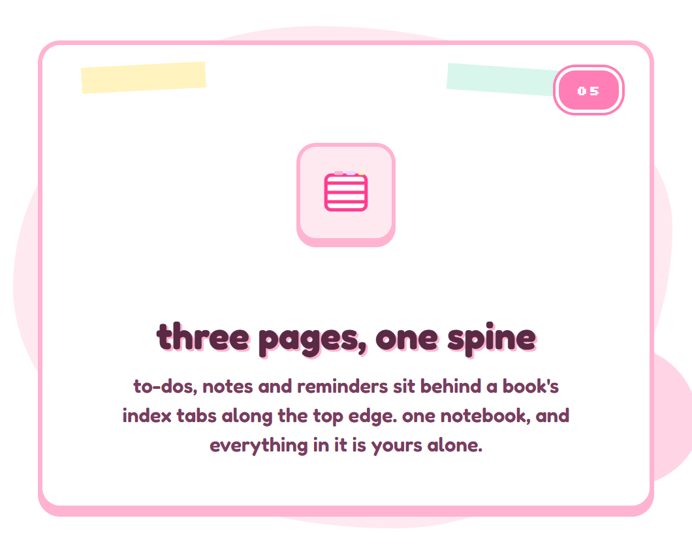</td>
    <td>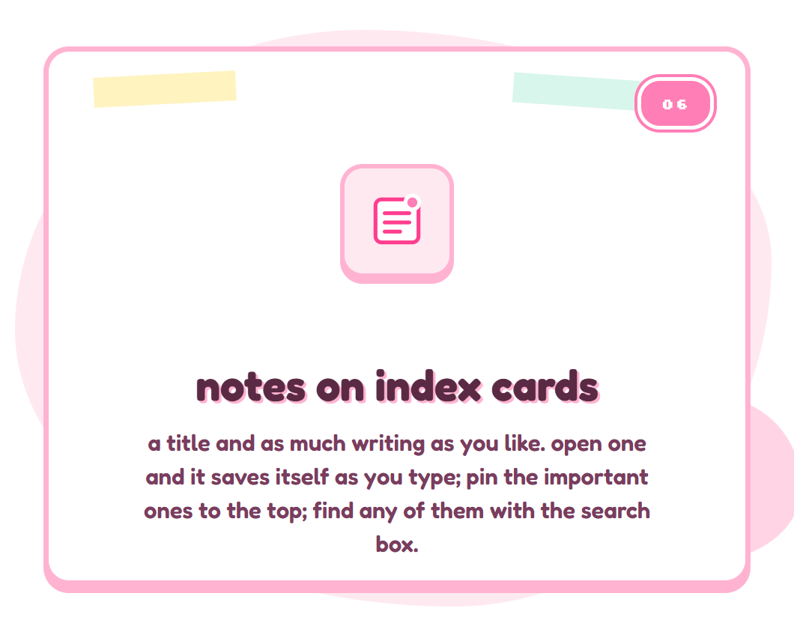</td>
  </tr>
  <tr>
    <td colspan="2">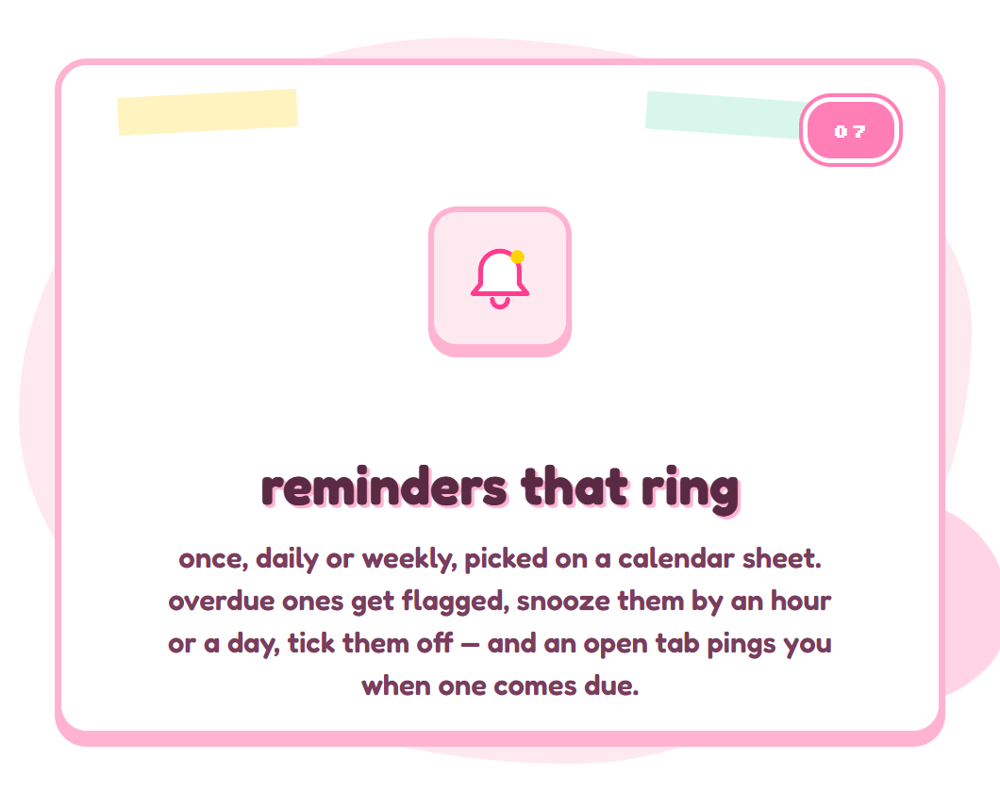</td>
  </tr>
</table>

1. Hit **log in with discord**. Discord asks for the `identify` scope only — id, name, avatar. No email, no servers.
2. You're in your notebook. Only you can see it; every read and write is scoped to your account.
3. **to-dos** — add things, check them off, drag to reorder, clear the done ones. A daisy blooms on every check — and when the last one goes, the whole title blooms.
4. **notes** — index cards with a title and as much writing as you like. Open one and it saves itself as you type; pin the important ones to the top; find them with the search box.
5. **reminders** — a thing to do at a time, picked on a calendar sheet: once, daily or weekly. Overdue ones get flagged; snooze by an hour or a day, or tick them off. While a BBNotes tab is open it pings you with a browser notification when one comes due.
6. Come back next week, on your phone, after clearing your cache — it's all still there.

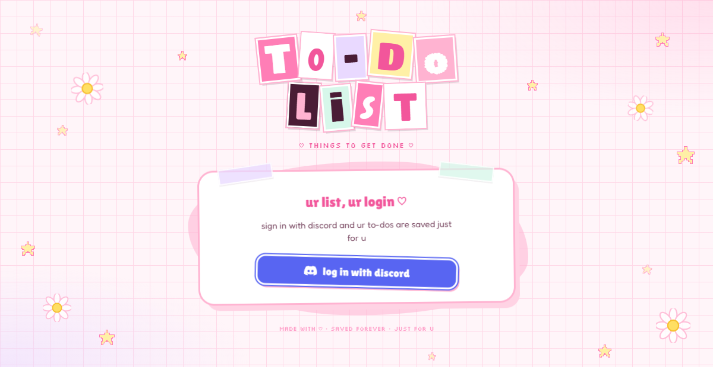

Sticker-bomb collage energy: ransom-note letters cut from different papers, chunky
white-outlined cards on grid paper, washi tape, pixel stars, and daisies that sway in
the corners. Every check pops eleven more daisies out of the box. The three pages hang
off a book's spine along the top edge — index tabs on every screen, a sheet that slides
up for the calendar on phones.

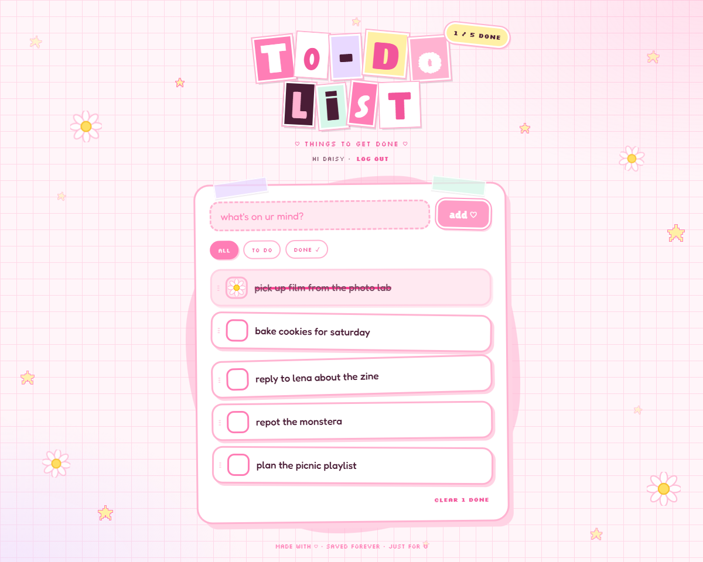

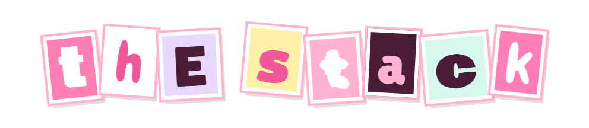

| | |
| --- | --- |
| **Frontend** | React 19 + Vite — no UI framework, hand-rolled CSS |
| **Backend** | Express 5 on Node 22 |
| **Database** | SQLite via the built-in `node:sqlite` — one file, WAL mode; to-dos, notes and reminders side by side |
| **Auth** | Discord OAuth2 (`identify` only), httpOnly session cookie |
| **Reminders** | No server push: an open tab checks the clock and rings a browser notification when one comes due |
| **Deploy** | One process serves both the site and the API, under a path if you like (`PUBLIC_URL`), with a coming-soon page when it isn't open yet (`COMING_SOON=1`) |

